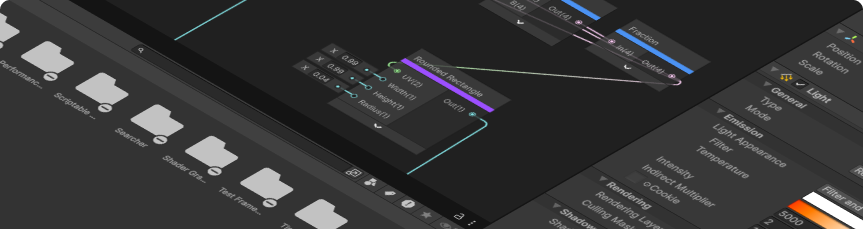

<h1>Hola, soy <a href="https://www.linkedin.com/in/montoyapl" target="_blank" rel="noopener noreferrer">Luis Montoya</a>! 👋🏻</h1>

  🥽 <strong>Desarrollador XR</strong> | 🧑🏻‍💻 <strong>Especialista en Unity</strong> | 🐛 <strong>Programador C#</strong>

**Mi nombre es _Luis Manuel Montoya Pilón_**, aunque muchos me conocen simplemente como **Montoya**.  
Soy originario de **México** y cuento con más de **3 años de experiencia** como desarrollador en `Unity` y `.NET C#`.

Me especializo en el desarrollo de **soluciones interactivas** como videojuegos, herramientas y aplicaciones, enfocadas a diferentes plataformas y sectores.

Tengo un gran interés en todos los aspectos relacionados con la **realidad aumentada (AR)**.  
Disfruto crear **arte**, investigar, diseñar **bibliotecas y herramientas**, así como compartir conocimiento a través de la **enseñanza**.

Si compartes alguno de estos intereses, **no dudes en ponerte en contacto conmigo.**
Estoy activo en varias plataformas:

<table>
  <tr>
    <td><strong>🔗 LinkedIn:</strong> <a href="https://linkedin.com/in/tu_perfil">tu_perfil</a></td>
    <td><strong>🐦 Twitter:</strong> <a href="https://twitter.com/tu_usuario">tu_usuario</a></td>
  </tr>
  <tr>
    <td><strong>📫 Gmail:</strong> <a href="mailto:tu.email@gmail.com">tu.email@gmail.com</a></td>
    <td><strong>🎥 </strong> <a href="[www.youtube.com/@montoya_pl](https://youtube.com/@montoya_pl?si=TEgiAHcjoXGYxF9r)">YouTube</a></td>
  </tr>
</table>

> [!NOTE]
> ***🎉 Muchos de mis proyectos son gratuitos y de código abierto; puedes ver los más destacados abajo. 👇🏻***
